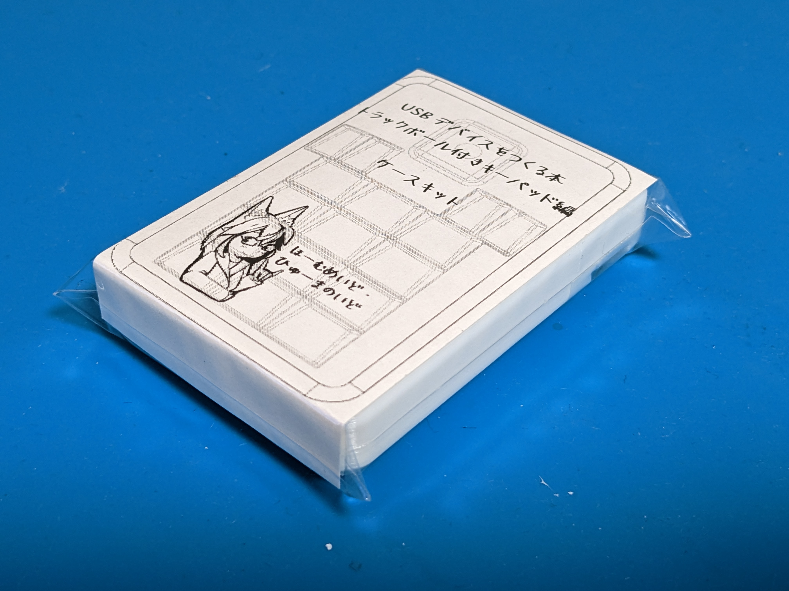
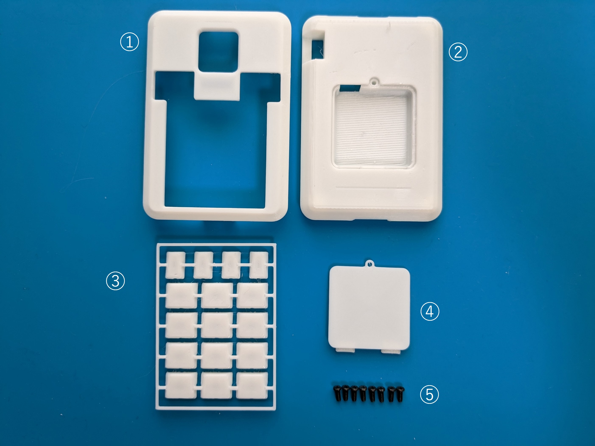
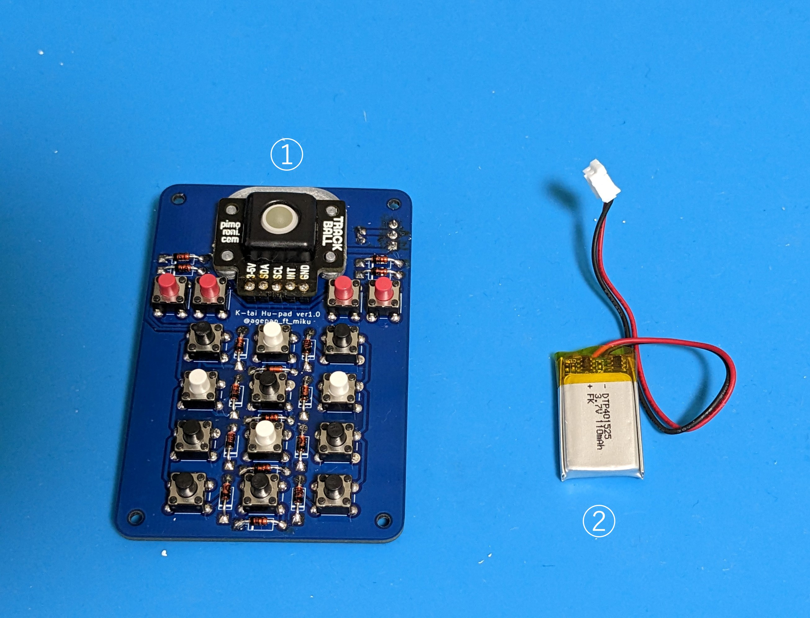
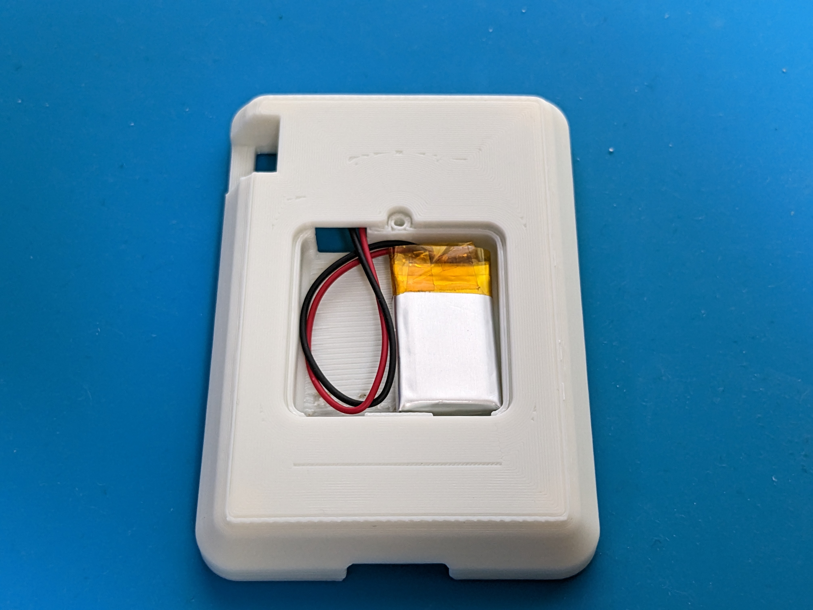
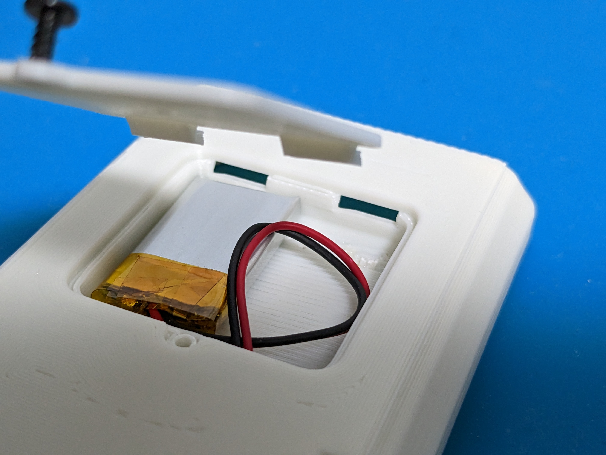
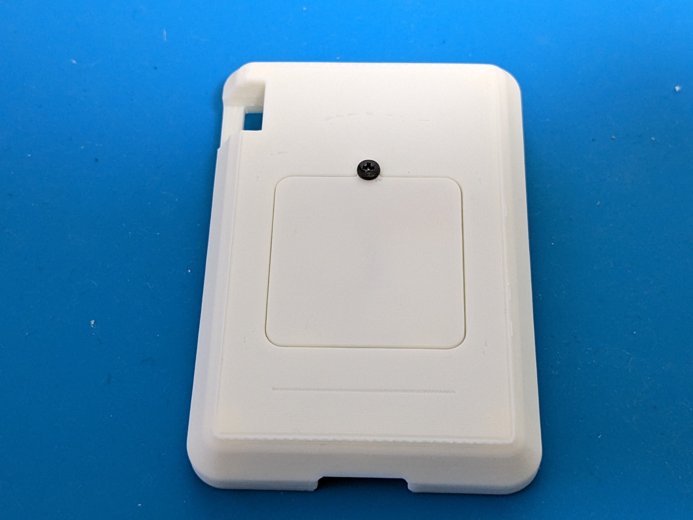
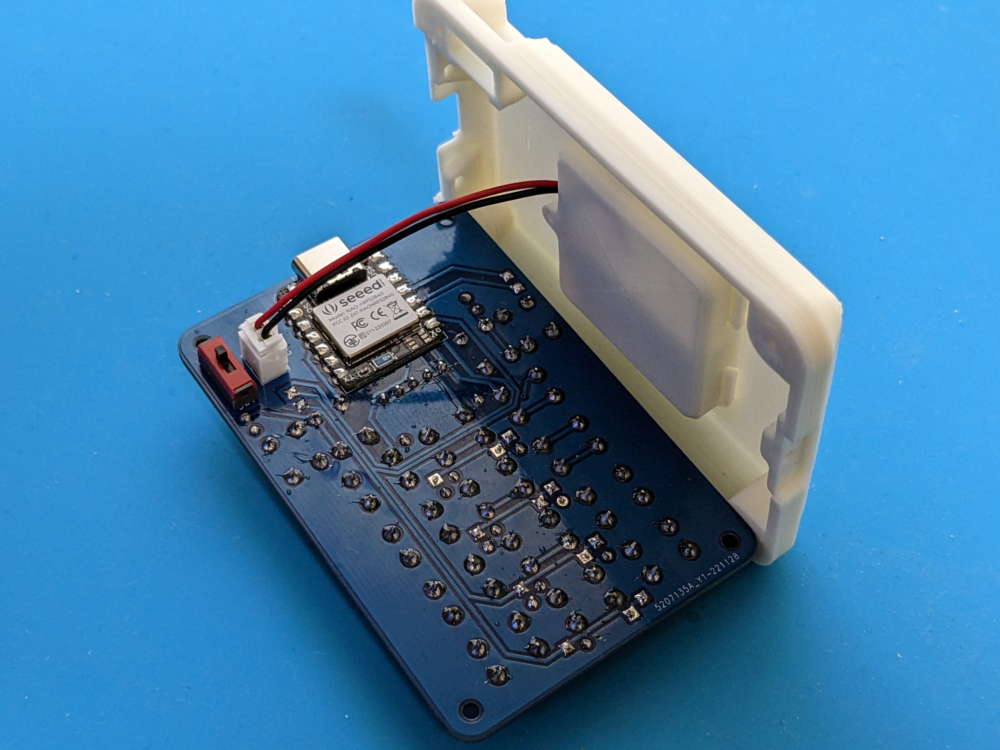
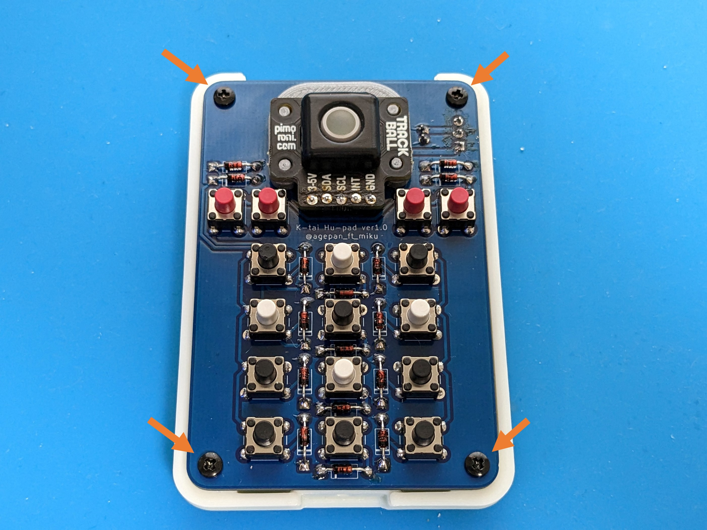
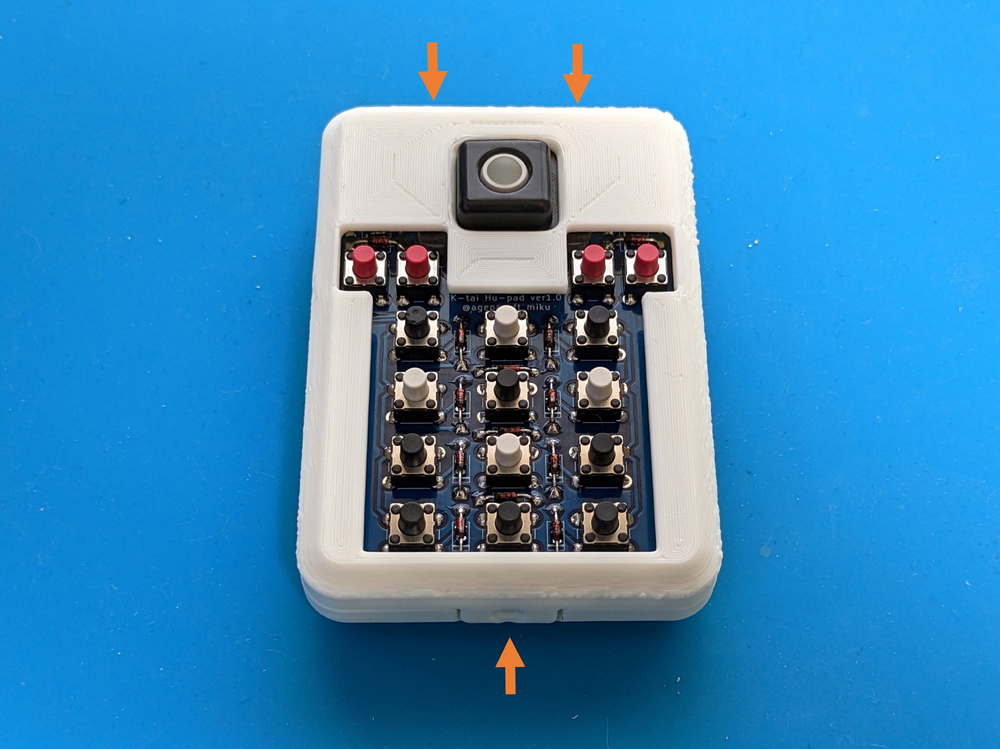
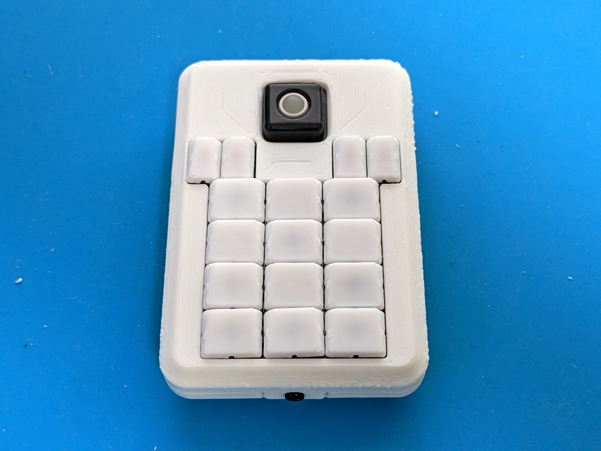

# K-tai-Hu-Pad Case Kit

本項ではケースキットの組立方法を解説します。 

 

# 内容物

①　ケース（上） 
②　ケース（下） 
③　キーキャップ 
④　バッテリカバー 
⑤　ネジ(M2L5) ×8

 

# ケースキットの他に用意するもの
① 部品実装済み基板 
② リチウムイオンポリマー電池(110mAh)

 

# 組立方法
1. リチウムイオンポリマー電池を用意し、ケース（下）にリチウムイオンポリマー電池を入れます。 
リチウムイオンポリマー電池のケーブルはくぼみ内の穴に通します。

2. バッテリカバーを用意し、バッテリカバーの突起をケース（下）の穴に組み合わせるように蓋をします。

3. バッテリカバーをネジで固定します。 

4. 部品実装済みの基板を用意し、基板側のコネクタにリチウムイオンポリマー電池のケーブルを接続します。

5. 基板の四隅をネジで固定します。 

6. ケース（上）を被せ、上部と下部の3箇所をネジで固定します。

7. キーキャップをランナーから取り外します。

8. 基板上のタクトスイッチにキーキャップをはめ込みます。

以上で完成です。
 